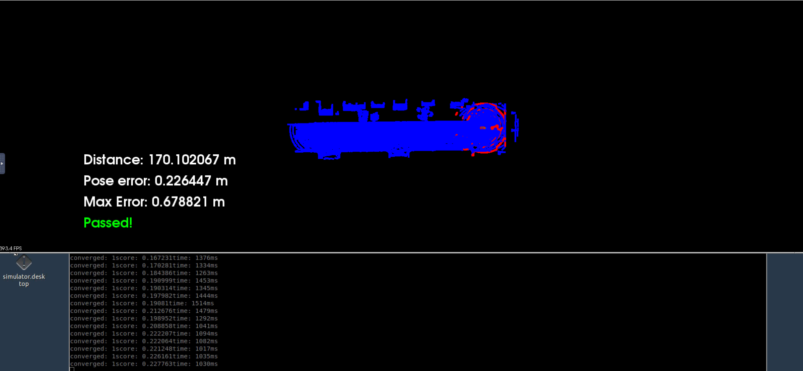
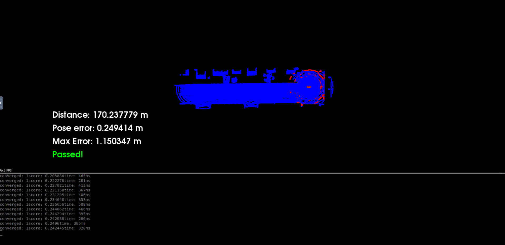

# Localization
This is the project for the third course in the  [Udacity Self-Driving Car Engineer Nanodegree Program](https://www.udacity.com/course/c-plus-plus-nanodegree--nd213) : Localization

## License
[License](LICENSE.md)

# Scan Matching Localization
This project is divided into 3 sections that have to be done simultaneously. 

- Section 1: Presentation&Compilation
  - The code is presented in simple and easy to understand.
  - The code should run without any failure.

 

- Section 2: Localization
  - The car is able to drive in the stimulator at least 170m and the pose error never goes up to 1.2m.
  - The car is able to move continuously in a medium speed when localizing. (too slow would be fail)

 

- Section 3: 3D Scan Matching
  - The ground truth is only used at the beginning of localization only and the lidar data should be used to localize.

All of these sections are run in Udacity Workspace and the final video for submitting is uploaded to the youtube.

# Usage
This project is using Iterative Closest Point(ICP) and Nomal Distributions Transform(NDT) to localize the movement of the car in the stimulator. All the steps are written in the [c3-main.cpp](code/c3-main.cpp). To run the stimulator, follow the steps below in the Unix command (assuming run in the Udacity Workspace and open the Terminator):
 

>su - student (# Ignore Permission Denied, if you see student@ you are good)
>
>cd c3-project
>
>./run_carla.sh

 

Open another termainal:
 

>su - student
>
>cd c3-project
>
>cmake .
>
>make

 

Run the project for NDT algorithm (first algorithm to run as default in the code):
>./cloud_loc

Run the project for ICP algorithm
>./cloud_loc 2

The project will be running in the stimulator and it is not moving in the beginning. To start the stimulator, press UP key 3 times with a short time gap in between (around 1 second). The stimulator will fail or show 'Try Again' in the first run. Close the program by 'Ctrl+C' and re-run it. The project should be fine to localize in the second time or third time run.

# Demonstration
The pictures shown are just the final frame of the video. To watch the full demo, please follow the link provided below.

**Algorithm 1: Normal Distributions Transform(NDT)**

https://youtu.be/HmjvcuvbT60

**Algorithm 2: Iterative Closest Point(ICP)**

https://youtu.be/FSpSEhxlbqw

